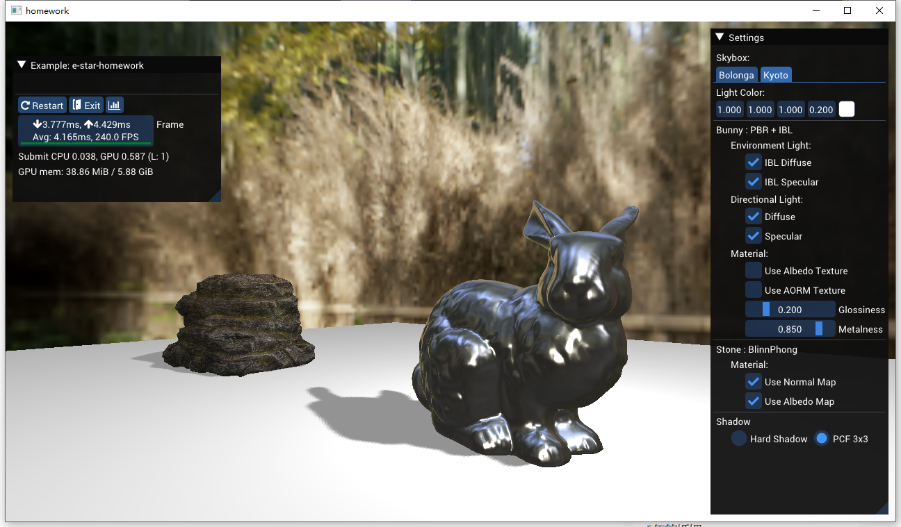

# Program Documentation
## 一、Operating Instructions

The above picture shows the rendering result in the default state of the program. Among them, the lighting model of rabbit is PBR+IBL of metal workflow, and does not use texture to control albedo, roughness and metalness; the lighting model of stone is Blinn-Phong, and texture is used to control normal and albedo; shadow uses The kernel is generated as a 3x3 PCF; the light color is white and the position changes periodically.

On the right side of the interface is the controller, which is used to control the rendering effect, which can be roughly divided into five parts from top to bottom, as shown in the figure.

  

Among them, the first part is used to control the cube map used by the sky box; the second part is used to control the color of the light; the third part is used to control the rendering results of the rabbit, including ambient light diffuse reflection, ambient light highlight, direct light diffuse reflection , direct light highlights, etc.; the fourth part is used to control the rendering results of the stone, including whether to use the normal map and whether to use the albedo map; the fifth part is used to control the shadow effect, in which the PCF algorithm is used to obtain soft shadows.

##  二、Function Description
### 2.1 Model loading
The program can successfully load the stone and rabbit models and display them successfully; drag the left mouse button to rotate the lens; slide the wheel with the mouse to zoom the lens; keyboard ADWS can control the lens to pan left and right up and down.
### 2.2 Blinn-Phong
The lighting model used by the stone model is Blinn-Phong. In addition to using albedo maps to control the surface color, it can also use normal maps to increase surface details. The specific effect is as follows.  
Use a normal map:  

  

Without using a normal map:  

  

The final result after adding the texture map:  

  

### 2.3 PBR
The lighting model of the rabbit model is PBR. When only direct lighting is considered, and texture is used to control albedo, the rendering results of roughness and metallicity are shown below.

  

### 2.4 IBL
On the basis of Section 2.3, add ambient lighting to the rabbit model, and the rendering results are shown below.

  

### 2.5 Shadow
The program implements two shadow generation methods, and the effect is shown in the following figure.

  

  

